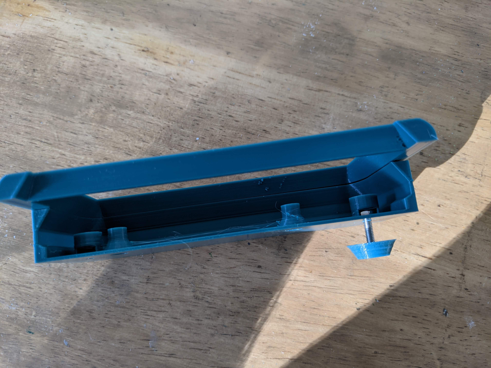
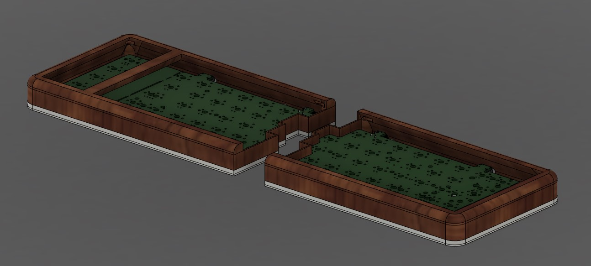
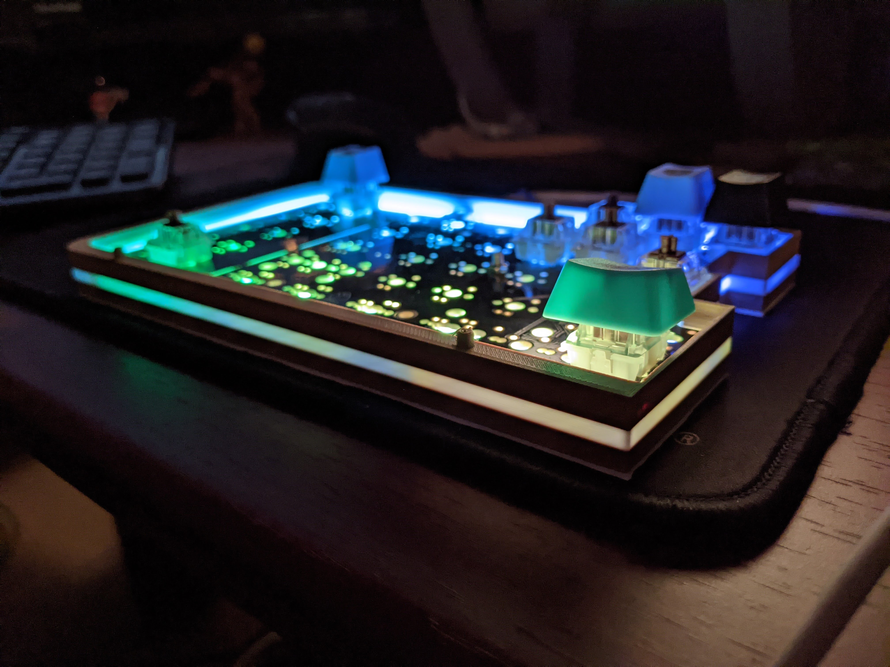

# V2.2 - 10/28/2020
### Minor tolerance updates for ease of assembly
- Adjusted pcb hole size back to 3.3mm in diamter, up from 3.1mm
    - 3.1mm is too tight when screwing into a nut, makes it even harder to secure pcb
    - Left case holes as 3.1mm. Tight is ok in this situation. Instead of using captured nut, you can get away with just screwing straight into the PLA, creating threads as you go.
        - Fairly easy to change this in CAD files, or with a dremel/drill to embiggen it.
- Added small holes to back of each of the leg screw holes.
    - This makes it a lot easier to remove tightly captured nuts by poking them with a small pin.
- Top case files are now meant to be printed in the default orientation (case top is last layer)
    - removes need for difficult to remove sacrificial support layer inside the captured nut holes
    - Printing left half will require slicer supports under the macropad seperator now.
- Removed fillet around the top of the case, replaced it with a sleeker looking chamfer.

# V2.1 - 10/22/2020

### Adjustable Keyboard Feet
- Added CAD and STL files for simple adjustable foot part.
- M3 screw of any length fits in tightly to cut cone piece.
- M3 nut can be inserted into up to 4 slots on each case, 2 in front, 2 in back
    - Add legs to back to get typical keyboard leg tilt
    - Add legs to front to get negative tilt
    - Add to sides to get tenting
    - Experiment with adding different length screws to each of the 4 to get the most comfortable tilt/tent angle for you.
- screw + foot can be screwed into these holes.
    - Length is variable on screw height and by how much you tighten the screw
    - Should get about ~5mm of adjustment.
- Optionally add a small rubber dome to the end for extra height and grip on desk

# V2 - 10/21/2020

### Case Redesign
- Redesigned so that 'light strip' is along the bottom.
    - This should make the glow along this strip much brighter; Before, the light strip began at a similiar height as the LEDS, now it is below.
- Can be printed in 2 seperate pieces now, with no filament swaps needed to achieve a 2 color case.
    - Filament swaps can be a tad annoying.
    - If you're printing in wood filament and wish to stain/paint the wood portions, it's much easier to post process the wood part now that its a seperate piece instead of a different filament on 1 part.
    - Pegs used for friction fit would snap easily, and warping could cause gaps in the case.
    - Screws together now, so whole thing should be more solid and like one piece

# V1 - 10/14/2020

### Initial Release

- 'light strip' is a thin white section in the middle of the case
- Printed in 4 filament swaps
- left side of the case has top section that friction fits onto the rest of the case, after PCB installed
